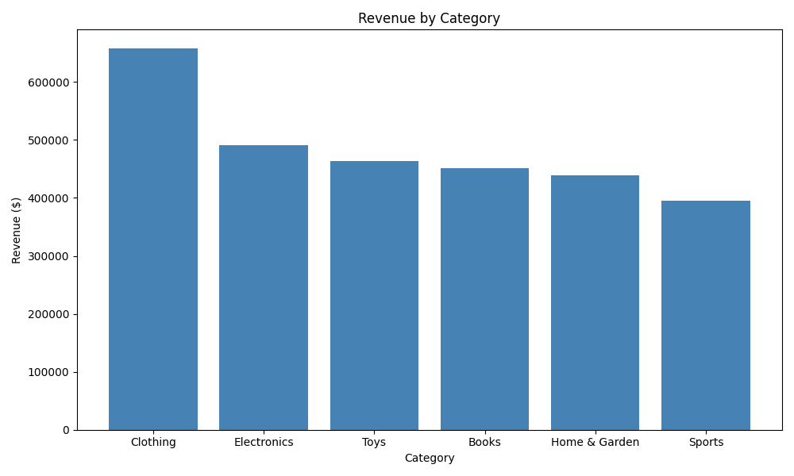
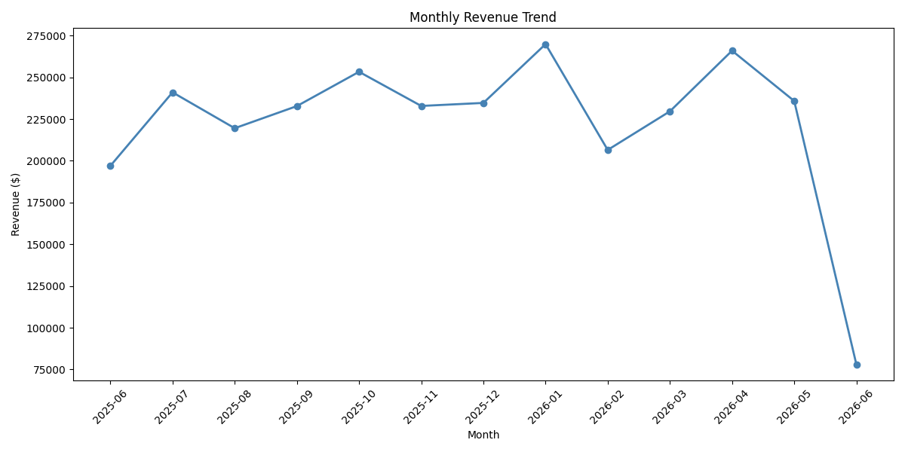
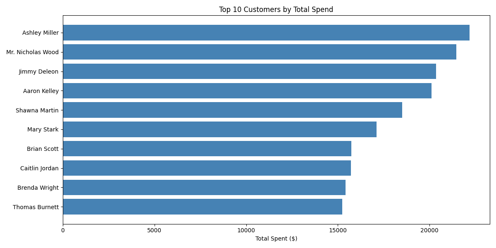

# 🛒 E-Commerce Analytics

A data analytics project built with **MySQL** and **Python** that simulates a real e-commerce database, generates fake data, runs business analytics queries, and visualizes insights.

---

## 📁 Project Structure

```
ecommerce-analytics/
│
├── sql/
│   └── 2_analytics.sql       # All SQL analytics queries
│
├── python/
│   ├── generate_data.py      # Generates fake data and populates the database
│   └── visualizations.py     # Pulls data and creates charts
│
├── revenue_by_category.png   # Bar chart: revenue per category
├── monthly_revenue.png       # Line chart: monthly revenue trend
└── top_customers.png         # Bar chart: top 10 customers by spend
```

---

## 🗄️ Database Schema

4 tables designed with normalized relationships:

| Table | Description |
|---|---|
| `customers` | 500 customers with name, email, city, signup date |
| `products` | 100 products across 6 categories |
| `orders` | 2000 orders with status tracking |
| `order_items` | Line items linking orders to products |

---

## 🔍 SQL Analytics Queries

| # | Question | Concepts Used |
|---|---|---|
| 1 | Total number of customers | `COUNT` |
| 2 | Orders by status | `GROUP BY` |
| 3 | Top 10 best-selling products | `JOIN`, `SUM`, `ORDER BY` |
| 4 | Revenue by category | Multi-table `JOIN`, `WHERE` |
| 5 | Monthly revenue trend | `DATE_FORMAT`, `GROUP BY` |
| 6 | Customers with no orders | `LEFT JOIN`, `WHERE NULL` |
| 7 | Top 10 customers by avg order value | Multiple `JOIN`s, calculated columns |

---

## 📊 Visualizations

### Revenue by Category


### Monthly Revenue Trend


### Top 10 Customers by Spend


---

## 🚀 How to Run

### 1. Set up the database
Run the table creation script in MySQL Workbench:
```sql
-- Run 2_analytics.sql in MySQL Workbench
```

### 2. Install dependencies
```bash
pip install mysql-connector-python faker pandas matplotlib
```

### 3. Generate fake data
```bash
python generate_data.py
```

### 4. Generate visualizations
```bash
python visualizations.py
```

---

## 🛠️ Tech Stack

- **MySQL** — database design, querying, analytics
- **Python** — data generation, automation, visualization
- **pandas** — data manipulation
- **matplotlib** — data visualization
- **Faker** — realistic fake data generation

---

## 📚 What I Learned

- Designing a normalized relational database schema
- Writing complex SQL queries (JOINs, CTEs, window functions, date functions)
- Connecting Python to MySQL using `mysql-connector-python`
- Generating realistic fake data with the `Faker` library
- Visualizing query results with `pandas` and `matplotlib`
